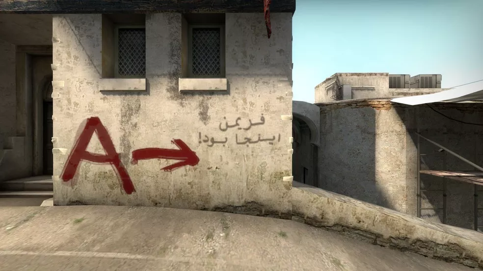
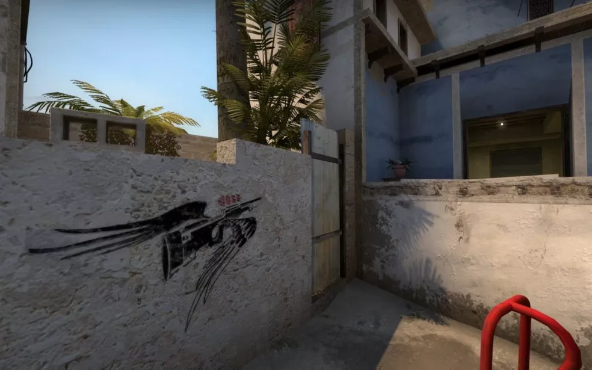
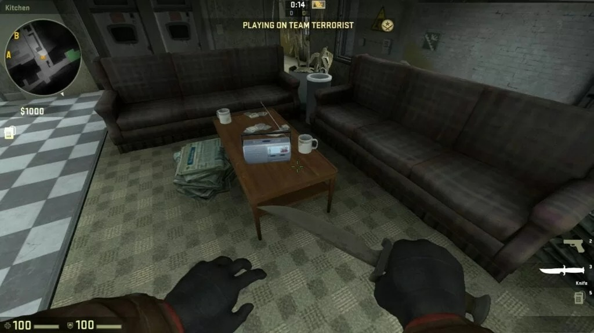
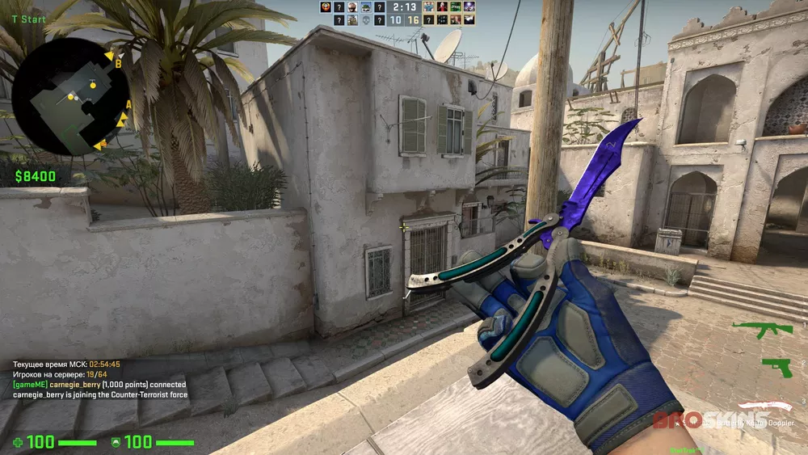
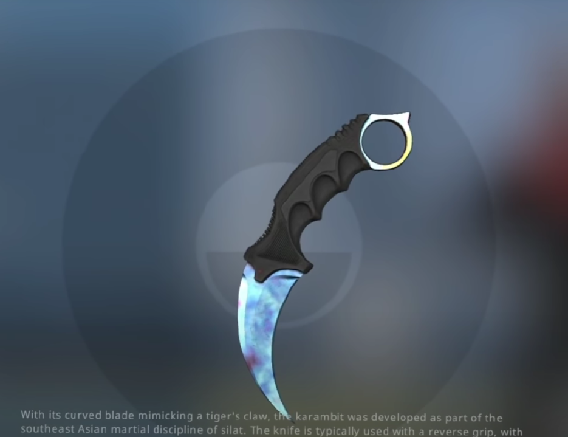

## Curiosidades Counter Strike Global Offensive

### Origem do CS
Counter-Strike nasceu como um mod do jogo Half-Life, icônico FPS também da Valve. 

 

### Dust 2
Para homenagear o jogo "irmão", CS:GO traz uma referência na Dust2. No spawn dos terroristas, na parede em direção ao meio, existe uma inscrição em persa que traduzida para português significa "Freeman esteve aqui". Trata-se de uma referência ao protagonista da série Half-Life, Gordon Freeman.

 

### Grafite na Miragem
Em homenagem a uma das jogadas mais icônicas do CS, a Valve colocou no mapa Miragem (o mapa mais jogado), um grafite na posição do tapete/van, esse se refere a jogada do Jogador brasileiro Coldzera em um campeonato profissional.

 

### Radio na Train
Um rádio na posição da cozinha no mapa Train toca o tema de TeamFortress 2.

 

### Gaulês, um Streamer de CSGO, atingiu o segundo lugar na plataforma de streaming, Twitch em 2021, de acordo com o Streams Charts, Gaulês teve 165.39 milhões de horas assistidas no período de um ano, contra 274.96 milhões de xQc.
### Molotov
A Molotov do lado dos Terrorista é $200 mais barata que a do lado dos contra terroristas além de ser mais forte possuindo 90% de penetração de colete.

 

Enquanto a Granada incendiária do lado dos Coutra Terroritas tem 73,75% de penetração de colete.

 

### É mais rápido de mudar pra arma depois de usar molotov do que granada incendiária
### A Skin mais de faca mais cara do csgo é a Butterfly Knife Doppler Sapphire chega a cerca de R$ 73 mil

 

### Se trantando de itens de colecionador, o mais caro ja estimado seria a faca Karambit Case Hardened, estipulasse que seu valor chegue aos 2 milhoes de dolares, convertendo 10307838,00 de reais 

 

